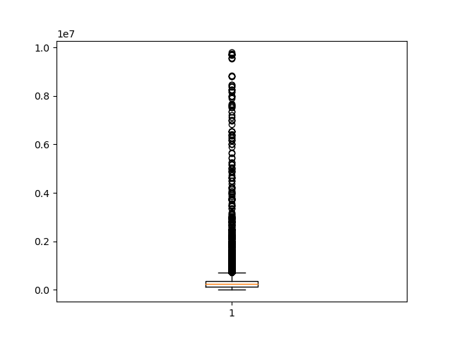
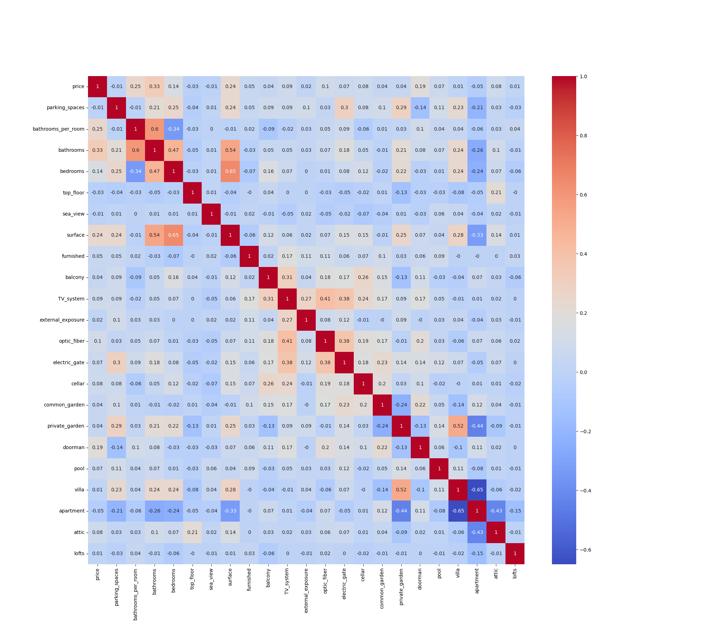

# Italy Real Estate Price Prediction

## Table of Contents
- [Overview](#overview)
    - [Dataset](#dataset)
- [Results](#results)
    - [Outlier Detection with Boxplots](#outlier-detection-with-boxplots)
    - [Heatmap Analysis](#heatmap-analysis)
    - [Model Selection](#model-selection)
    - [Statistical Insights](#statistical-insights)
    - [Visualizations](#visualizations)
- [Acknowledging Variability](#acknowledging-variability)
- [Summary](#summary)

## Overview
The Italian real estate market is multifaceted, influenced by diverse factors such as location, property attributes, economic conditions, and more. Accurate house price predictions in this dynamic environment are crucial for various stakeholders, including buyers, sellers, real estate professionals, and investors. This project aims to address this challenge by harnessing data and machine learning methodologies to create a robust and reliable house price prediction model tailored to the Italian market.

### Dataset
Central to this project is a dataset originally in Italian, which we meticulously translated into English. This comprehensive dataset encompasses a diverse array of property features, including geographical information, property size, condition, amenities, and most significantly, the sale prices. The dataset's diversity presents a unique opportunity to uncover intricate patterns and relationships that can be leveraged for predictions.

## Results
After a rigorous process of data preparation, model building, and analysis, here are the key results of our Italy real estate price prediction project:

### Outlier Detection with Boxplots
In our analysis, we used boxplots as a robust method to identify and visualize outliers in the dataset. Boxplots provide a clear representation of the distribution of a feature, including the presence of outliers. Outliers, which are data points significantly different from the majority, can skew model predictions.

We also implemented a strategy to handle outliers by setting them to the upper bound of the feature's distribution. This approach helped ensure the robustness of our predictive model and mitigate the influence of extreme values.

### Heatmap Analysis
One of the valuable visualizations we utilized in our project is a heatmap. The heatmap is a graphical representation that displays the correlations between different features in the dataset.

In our analysis, we found that the correlations on the heatmap ranged from as low as 0.01 to as high as 0.33. This information allowed us to identify which features had a significant impact on house prices and which features were less influential. The heatmap analysis provided insights into the relationships between features such as location, property size, and amenities, and how they correlated with property prices. It helped us understand which variables were most important when predicting house prices in the Italian real estate market.

### Model Selection
After hyperparameter tuning, we compared the performance of two Random Forest models: one tuned with GridSearchCV and the other with RandomizedSearchCV. The evaluation metric used was the R-squared (R2) value, which measures how well the model fits the data.

It's worth noting that the Random Forest model with RandomizedSearchCV yielded higher R2 values for both testing and training data:

Random Forest with GridSearchCV:
- R2 for Testing Data: 0.62
- R2 for Training Data: 0.70

Random Forest with RandomizedSearchCV:
- R2 for Testing Data: 0.75
- R2 for Training Data: 0.93

While the Random Forest model with RandomizedSearchCV showed better performance in terms of R2, it's important to consider the risk of overfitting. Overfitting occurs when a model performs exceptionally well on the training data but poorly on the testing data because it has essentially memorized the training data rather than learning the underlying patterns.

In summary, we opted for the Random Forest model with GridSearchCV despite its lower R2 values, as it offers a balance between model performance and generalization to ensure robust predictions on unseen data.

**Prediction Tool:** We developed a user-friendly code that allows users to input property features, generating price predictions based on the selected Random Forest model.

    # Define feature values for prediction as a dictionary
    feature_values = {}

    # Iterate through the feature names (columns)
    for feature in X.columns:
        feature_values[feature] = float(input(f"Enter value for {feature}: "))

    # Make a price prediction
    predicted_price = rf_model.predict(pd.DataFrame([feature_values]))

    # Print the predicted price
    print("Predicted Price:", round(predicted_price[0], 0))

### Statistical Insights 
Leveraging Spark SQL, we extracted essential statistics, offering deeper insights into property characteristics, including median prices and other relevant information.

### Visualizations 
Using Tableau, we created interactive visualizations, including charts and maps, to enhance data comprehension and communicate model results effectively.

**Tableau Link:** https://public.tableau.com/app/profile/jonathan.koo7596/viz/project4_16956997848100/Story1?publish=yes

## Acknowledging Variability
It's crucial to note that while our model provides valuable predictions, real estate prices are influenced by numerous dynamic variables that can change over time. Market conditions, economic factors, and other external forces can impact property prices. Therefore, our predictions should be considered as estimates based on historical data and property features. Users should exercise discretion and consult with real estate professionals to consider all relevant factors when making real estate decisions.

## Summary
In summary, our project aimed to predict house prices in Italy by transforming a translated dataset into valuable insights. We chose the Random Forest model with GridSearchCV as our predictive model due to its robustness and generalizability. With a user-friendly prediction tool, statistical insights, and interactive visualizations, we offer a comprehensive solution for accurately estimating house prices in the Italian real estate market. Our model's strong performance on testing and training data ensures its reliability in practical applications, benefiting a wide range of stakeholders in the real estate industry, while recognizing the inherent variability in real estate prices.
